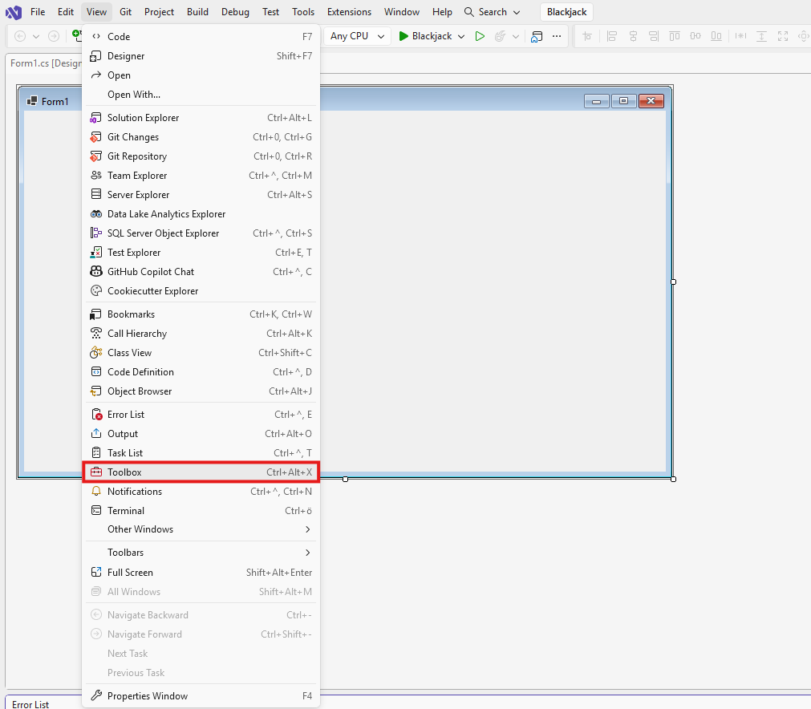
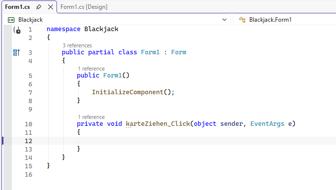

# Blackjack
## Schritt 1:
Erstelle ein neues Project.\
**WICHTIG**: Erstelle ein WinForms Project! Wähle WinForms aus anstatt Konsolenanwendung.\
[Neues Project Tutorial](../Tutorials/NewProject.md)

## Schritt 2:
Öffne die Toolbox:



Öffne jetzt an der rechten seite (die Toolbox) den reiter All Windows Forms und füge mit drag and drop ein button und ein Textfeld hinzu.

Der button soll dazu da sein um Karten zu ziehen.\
Mache auf den butten ein rechts-cklick und drücke auf Properties.\
In dem Fenster, welches sich unten rchts geöffnet hat änderst du unter dem Reiter 'Appearance' bei 'Text' 'button1' -> 'Karte ziehen'.\
Ändere die größe des buttons so, dass die wörter auch zu sehen sind.\
Ändere ebenfalls im Fenster unten rechts unter dem Reiter 'Design' den '(Name)' 'button1' zu 'karteZiehen'.

Mache rechts-klick auf das Textfeld und drücke auf Properties. Ändere hier, wie beim button den '(Name)' zu 'aktuelleKarten'.

## Schritt 3:
mache ein doppel-klick auf den button.\
Es sollte sich so ein Fenster öffnen:


Füge über dem Konstruktor eine Private Liste `_kartenStapel` hinzu, welcher als Kartenstapel diehnt:
```
private List<(string name, int wert)> _kartenStapel;
```

In `_kartenStapel` ist der Wert (`int`) und Name (`string`) jeder ´Karte im Kartenstapel gespeichert.

Füge nun im Kostructor `Form1()` code hinzu, welcher alle Karten generiert.

## Schritt 4:
Die Methode '`karteZiehen_Click()`' wird ausgeführt, wenn der Button gedrükt wird.\
Füge in dieser Metode code hinzu, welcher eine [zufällige](../Tutorials/Random.md) Karrte aus dem Kartenstapel auswählt und diese vom Stapel entfernt.

Anschließend soll die ausgewählte Karte beim textFeld aktuelleKarten angezeigt werden.
Benutze hierfür `aktuelleKarten.Text`.

## Schritt 5:
Füge unter dem `_kartenStapel_` ein weiteres privates feld `private int _score` hinzu, welcher den wert aller bereits gezogenen Karten zusammengezählt speichert.

Erstelle ein weiteres Textfeld und zeige dort den Score an.

Wenn der score größer oder gleich 21 ist kann man keine weitere Karte ziehen.

## Schritt 6:
Füge im Form-Designer ein neuen Button 'Keine Karte' und ein neues TextFeld hinzu, welcher die Karten des Bots repräsentieren;

Wenn 'Keine Karte' gedrückt wurde sollen zufällige karten gezogen und beim neuen TextFeld angezeigt werden, bis der wert der gezogenen Karten min. 16 ist.
