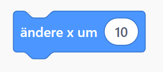

# Simple Bewegungen
Ziel ist die Katze mit W A S D bewegen zu können.

## Phase 1
Füge 4 Tastenereignissblöcke hinzu:\
\
Ändere die Tasten so dass du jeweils ein ereignis für die Tasten 'W', 'A', 'S' und 'D' hast.\

## Phase 2
Füge nun unter jedem ereignis eine bewegung (ändere x, bzw. y um 10) hinzu:\
\
Verbinde die bewegungsblöcken mit den Ereignissblöcken und die zahl so, dass:
- Wenn 'W' gedrückt wird die Katze sich nach oben bewegt
- Wenn 'A' gedrückt wird die Katze sich nach links bewegt
- Wenn 'S' gedrückt wird die Katze sich nach unten bewegt
- Wenn 'D' gedrückt wird die Katze sich nach rechts bewegt

Die Katze sollte sich mit einem Tasendruck um 10 einheiten bewegen

## Lösung
Falls du nicht weiter kommst kannst du dir die [Lösung](LösungAufgabe1.md) angucken.
