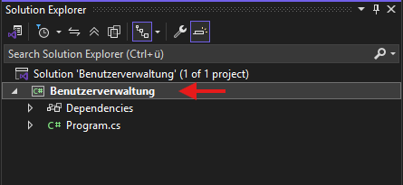
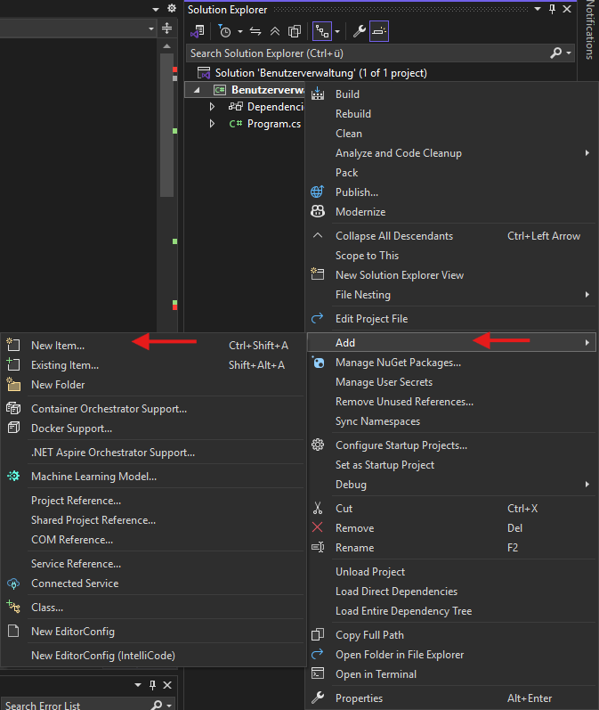

# Wie erstelle ich eine neue Klasse?

## Was ist eine Klasse?

Eine Klasse dient dazu, Daten und Funktionen logisch zusammenzufassen.

In der Benutzerverwaltung soll beispielsweise jeder Benutzer folgende Informationen besitzen:

- Name
- Alter
- Lieblingsfarbe

Statt diese Informationen in mehreren einzelnen Variablen zu speichern, können wir eine eigene Klasse erstellen.

---

## Neue Klasse erstellen

1. Rechtsklick auf das Projekt (Beispiel: **Benutzerverwaltung**)



2. **Hinzufügen**
3. **Neues Element**



4. **Klasse** auswählen
5. Namen eingeben (z.B. `User`)
6. Auf **Hinzufügen** klicken

Visual Studio erstellt nun automatisch eine neue Datei namens `User.cs`.

---

## Beispiel einer Klasse

```csharp
namespace Benutzerverwaltung
{
    class User
    {
        public string Name { get; set; }
        public int Alter { get; set; }
        public string Lieblingsfarbe { get; set; }
    }
}
```

---

## Erklärung

### Namespace

```csharp
namespace Benutzerverwaltung
{
...
}
```

Der Namespace dient dazu, Klassen logisch zu gruppieren.

Normalerweise besitzen alle Klassen eines Projekts denselben Namespace.

---

### Klasse

```csharp
class User
{
...
}
```

Hier wird eine neue Klasse namens `User` erstellt.

Von dieser Klasse können später beliebig viele Benutzer angelegt werden.

---

### Eigenschaften (Properties)

```csharp
public string Name { get; set; }
public int Alter { get; set; }
public string Lieblingsfarbe { get; set; }
```

Diese Eigenschaften speichern die Daten eines Benutzers.

| Typ | Name | Beschreibung |
|------|------|------|
| string | Name | Name des Benutzers |
| int | Alter | Alter des Benutzers |
| string | Lieblingsfarbe | Lieblingsfarbe des Benutzers |

---

## Verwendung der Klasse

Nachdem die Klasse erstellt wurde, kann ein neuer Benutzer angelegt werden.

```csharp
User user = new User();

user.Name = "Max";
user.Alter = 25;
user.Lieblingsfarbe = "Blau";
```

Alternativ:

```csharp
User user = new User
{
    Name = "Max",
    Alter = 25,
    Lieblingsfarbe = "Blau"
};
```

---

## Die Program-Klasse

Jede Konsolenanwendung besitzt normalerweise eine `Program`-Klasse.

Darin befindet sich die `Main`-Methode:

```csharp
class Program
{
    static void Main(string[] args)
    {
        // Startpunkt des Programms
    }
}
```

Die `Main`-Methode ist der Einstiegspunkt des Programms.

Sobald die Anwendung gestartet wird, beginnt die Ausführung an dieser Stelle.

---

## Warum mehrere Klassen verwenden?

Zu Beginn wird häufig alles in die `Program`-Klasse geschrieben.

Bei größeren Projekten wird der Code dadurch jedoch schnell unübersichtlich.

Deshalb lagert man Daten und Funktionen in eigene Klassen aus.

Beispiele:

- `User` → Speichert Benutzerdaten
- `UserManager` → Verwaltet Benutzer
- `FileManager` → Speichert und lädt Dateien

Dadurch bleibt der Code übersichtlich und einfacher wartbar.

---

## Zusammenfassung

- Eine Klasse dient zum Zusammenfassen von Daten und Funktionen.
- Neue Klassen können über **Rechtsklick → Hinzufügen → Neues Element** erstellt werden.
- Die `Program`-Klasse enthält den Einstiegspunkt des Programms.
- Mit eigenen Klassen wird der Code strukturierter und leichter erweiterbar.
- Von einer Klasse können beliebig viele Objekte erstellt werden.
