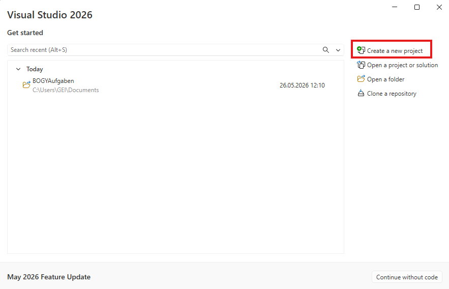
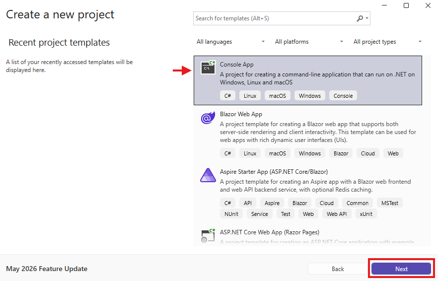
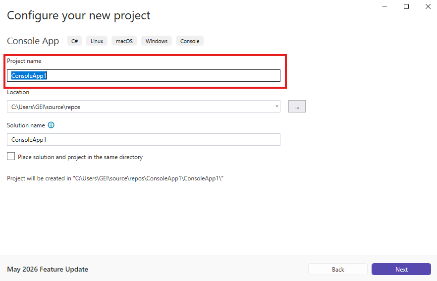
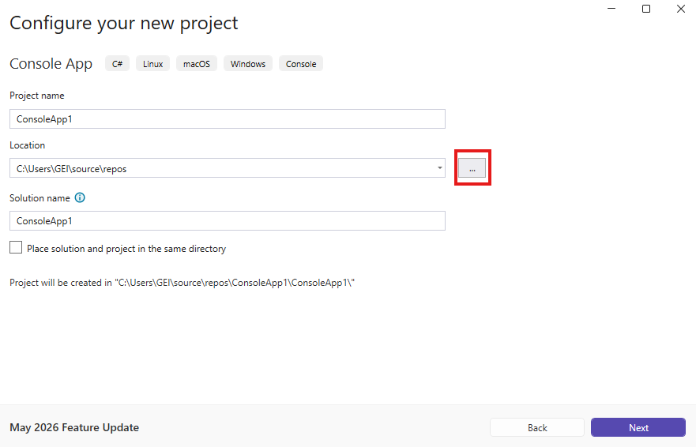
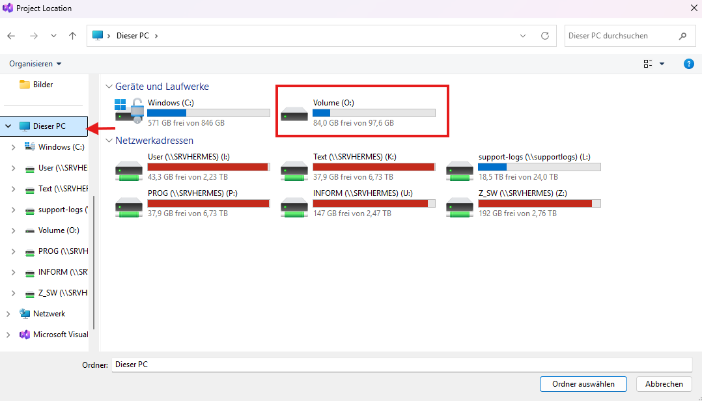
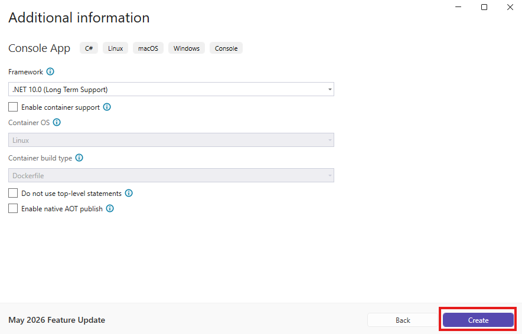

# Wie erstellt man ein neues Projekt?
## Schritt 1
Öffne Visual Studio und drücke auf 'Neues Projekt erstellen'.

## Schritt 2
Wähle 'Console App' und drücke 'Next' oder mache ein Doppel-Klick auf 'Console App'.

## Schritt 3
Gebe ein Projektname ein.

## Schritt 4
Wenn du den Namen eingegeben hast drücke auf 'Next'.

## Schritt 5
Drücke auf die drei Punkte.

## Schritt 6
Wähle in Dieser PC -> O: den ordner mit deinem Namen aus.\
Falls dieser nicht exsestiert erstelle einen.

## Schritt 7
Wenn du dinen Ordner ausgewählt hast drücke rechts unten auf 'Next'.

## Schritt 8
Klicke auf 'Create'

## Fertig