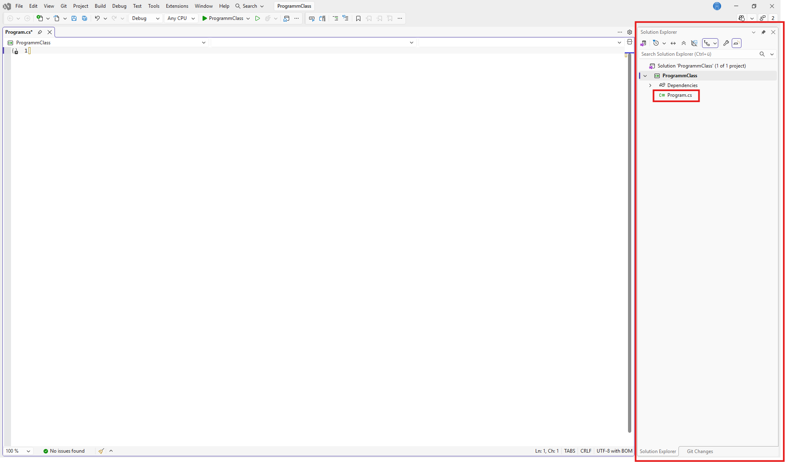

# Wie erstellt man die Programm Klasse
## Schritt 1
Stell sicher dass die datei leer ist.

## Schritt 2
Eine Klasse hat immer den selben namen, wie die Datei.\
In unserem fall ist das 'Program.cs' also nennen wir die Klasse 'Program'.\
Du kanns rechts an der seite eine übersicht der Dateien in deinem Projekt sehen. Dorst steht die Start datei 'Program.cs'


## Schritt 3
Gebe ein:
``` 
class Program 
{

}
```

## Schritt 4
Der einstiegpunkt des Programms ist die Main-Klasse.
Gebe ein:
``` 
class Program 
{
	public static void Main(string[] args) 
	{
	
	}
}
```

## Fertig
Tipp: Drücke Strg + s um die änderungen zu speichern!